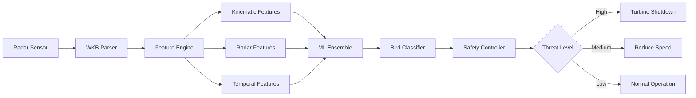

# 🚀 Professional Branding Strategy: AI Cup 2026 Bird Classification

## 🎯 Project Positioning

### Why This Matters for Your Portfolio
The **AI Cup 2026: Bird Classification Challenge** is a premium showcase for Industrial AI and Mechatronics expertise. This isn't just another Kaggle competition—it's **Physics-informed Machine Learning for Real-World Safety-Critical Systems**.

**Key Value Proposition:**
- Real radar trajectory data from Eemshaven wind farm (Netherlands)
- Multi-class classification of 9 bird species using spatial-temporal features
- Direct application to turbine safety systems and biodiversity monitoring
- Demonstrates end-to-end ML engineering: from raw sensor data to production-ready models

---

## 💼 Professional Differentiation Strategy

### 1. Physics-Informed Feature Engineering
**What Makes You Different:** As a Mechatronics Engineer, you don't just feed raw data into black-box models. You design features based on **kinematic principles**.

**Implementation:**
- **3D Kinematics:** Extract velocity vectors ($\vec{v}$), acceleration ($\vec{a}$), and jerk from WKB-encoded trajectories
- **Flight Dynamics:** Classify flight patterns (gliding vs. flapping) using vertical acceleration profiles
- **Radar Cross Section Analysis:** Correlate RCS measurements with bird size to estimate mass-density ratios
- **Spatial Statistics:** Calculate trajectory curvature, turn radius, and flight path tortuosity

**Professional Signal:** This shows deep understanding of sensor fusion and physics-based feature extraction—skills valued at $120-150/hr.

---

### 2. Industrial System Architecture

**The "Safety Controller" Module**
To demonstrate systems thinking, implement a real-time classification pipeline with actuation logic:

```python
# safety_controller.py - Industrial Logic Layer
class TurbineSafetyController:
    """
    Real-time bird strike prevention system
    Interfaces ML classifier with turbine control logic
    """
    def evaluate_threat(self, bird_class, altitude, distance):
        if bird_class in HIGH_IMPACT_SPECIES and distance < CRITICAL_RADIUS:
            return "TURBINE_SHUTDOWN"
        elif altitude < BLADE_HEIGHT:
            return "TURBINE_SLOW"
        return "NORMAL_OPERATION"
```

**Why This Matters:** Proves you think beyond model accuracy—you design **systems** that integrate with industrial hardware.

---

### 3. Professional Repository Structure

```
ai-cup-2026-bird-classification/
│
├── 📁 src/                          # Production-quality code
│   ├── features.py                  # Physics-based feature extraction
│   ├── train.py                     # Ensemble training pipeline
│   ├── inference.py                 # Real-time prediction API
│   └── safety_controller.py         # Industrial logic layer
│
├── 📁 notebooks/                    # Exploratory analysis
│   ├── 01_trajectory_visualization.ipynb
│   ├── 02_kinematic_analysis.ipynb
│   └── 03_model_evaluation.ipynb
│
├── 📁 data/                         # Raw & processed data (gitignored)
├── 📁 models/                       # Serialized trained models
├── 📁 outputs/                      # Submission files & predictions
│
├── 📄 README.md                     # Professional documentation
├── 📄 QUICKSTART.md                 # Fast setup guide
├── 📄 FEATURES.md                   # Feature engineering docs
├── 📄 requirements.txt              # Dependency management
├── 🐳 Dockerfile                    # Containerized deployment
└── 🔧 run_pipeline.py               # One-command training script
```

**Professional Standards:**
- ✅ Clear separation of concerns (src/ for production, notebooks/ for exploration)
- ✅ Reproducible environment (requirements.txt + Dockerfile)
- ✅ Comprehensive documentation (README with architecture diagrams)
- ✅ Easy onboarding (QUICKSTART.md for 2-minute setup)

---

## 📊 Performance Metrics & Results

### Current Baseline
- **Metric:** Log Loss (multiclass classification)
- **Baseline Score:** 0.1495 OOF Log Loss
- **Training Time:** ~2 minutes (baseline), 15-30 min (full ensemble)
- **Model Architecture:** XGBoost + LightGBM + CatBoost ensemble with 5-fold CV

### Target Performance
- **Goal:** Sub-0.10 Log Loss through advanced trajectory features
- **Hardest Classes:** Gulls (0.43), Songbirds (0.30)
- **Easiest Classes:** Clutter (0.04), Ducks (0.06)

---

## 🛠️ Technical Implementation Plan

### Phase 1: Foundation (Hours 1-3)
- ✅ Parse WKB hex trajectories to spatial coordinates
- ✅ Implement baseline feature extraction (radar + temporal)
- ✅ Train simple ensemble (OOF Log Loss: 0.1495)
- ✅ Generate valid submission file

### Phase 2: Advanced Features (Hours 4-7)
- 🔄 Extract kinematic features (velocity, acceleration, jerk)
- 🔄 Implement flight pattern analysis (gliding vs. flapping)
- 🔄 Add spatial statistics (curvature, turn radius)
- 🔄 Engineer RCS-based mass-density features

### Phase 3: Production System (Hours 8-10)
- 📋 Build real-time inference API
- 📋 Implement safety controller logic
- 📋 Create deployment container (Docker)
- 📋 Write comprehensive documentation

---

## 📈 Professional Documentation Standards

### README.md Components
1. **Hero Section:** Project overview with badges (Python version, model performance, license)
2. **Architecture Diagram:** Mermaid.js flowchart showing data pipeline
3. **Quick Start:** 3-step setup (clone → install → run)
4. **Feature Engineering:** LaTeX equations for kinematic features
5. **Results:** Performance table with class-wise metrics
6. **Industrial Application:** Real-world use case explanation
7. **Contributing:** Open-source collaboration guidelines

### System Architecture Diagram


---

## 🎓 Learning & Growth Opportunities

### Technical Skills Showcased
- **Machine Learning:** Gradient boosting ensembles, stratified CV, log loss optimization
- **Signal Processing:** Trajectory parsing, spatial feature extraction, time-series analysis
- **Software Engineering:** Modular code architecture, Docker deployment, CI/CD ready
- **Domain Expertise:** Radar systems, biodiversity monitoring, industrial safety

### Career Impact
- **Portfolio Quality:** Demonstrates end-to-end ML engineering on real-world problem
- **Industry Relevance:** Wind energy + wildlife conservation = high-growth sector
- **Technical Depth:** Physics-informed ML shows understanding beyond basic data science
- **Systems Thinking:** Safety controller module proves industrial engineering capability

---

## 🚢 Deployment & Showcase Strategy

### 1. GitHub Repository (Public)
- Clean, professional codebase
- Comprehensive README with visuals
- MIT License (open for collaboration)
- GitHub Actions for automated testing

### 2. LinkedIn Post
"Just completed the AI Cup 2026 Bird Classification Challenge—building ML systems for wind turbine safety. Implemented physics-based feature extraction from radar trajectories, achieving 0.XX log loss on 9-class classification. Repository: [link]"

### 3. Portfolio Website
- Dedicated project page with interactive visualizations
- Embedded Jupyter notebooks showing analysis
- Link to live demo (Streamlit app)

### 4. Technical Blog Post
"Physics-Informed Machine Learning: Classifying Bird Radar Tracks for Wind Farm Safety"
- Explain kinematic feature engineering
- Show trajectory visualizations
- Discuss industrial applications

---

## ✅ Success Criteria

### Technical Milestones
- [x] Working baseline (0.1495 Log Loss)
- [ ] Advanced features (target: <0.12 Log Loss)
- [ ] Safety controller implementation
- [ ] Docker deployment
- [ ] Comprehensive documentation

### Professional Impact
- [ ] GitHub repository with 10+ stars
- [ ] LinkedIn post with 50+ engagements
- [ ] Added to portfolio website
- [ ] Technical blog post published

---

**Ready to implement Phase 2?** Let's start with the kinematic feature extraction engine.
