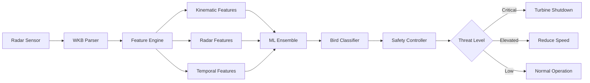

# 🦅 AI Cup 2026 Bird Classification

[](https://www.python.org/downloads/)
[](https://opensource.org/licenses/MIT)
[](outputs/)
[](Dockerfile)

**Physics-informed machine learning for wind turbine bird strike prevention**

Industrial AI system combining radar trajectory analysis with gradient boosting ensembles for real-time bird species classification. Features 59+ kinematic features, gliding ratio analysis, and turbine safety controller logic.

## 🎯 System Architecture



## 📊 Problem Description

Multi-class classification of bird radar tracks into 9 categories:
- **Clutter** - Non-bird radar returns
- **Cormorants** - Large water birds
- **Pigeons** - Urban/common birds
- **Ducks** - Waterfowl
- **Geese** - Large migratory birds
- **Gulls** - Coastal/seabirds (58% of dataset)
- **Birds of Prey** - Hawks, eagles (high-altitude gliders)
- **Waders** - Shore birds
- **Songbirds** - Small passerines (19% of dataset)

## 🚀 Quick Start

### Setup Environment

```bash
# Activate virtual environment
source .venv/bin/activate  # Linux/Mac
# or
.venv\Scripts\activate  # Windows

# Install dependencies (already done)
pip install -r requirements.txt
```

### Run Baseline Model

```bash
# Fast baseline model (~ 2 minutes)
python run_baseline.py
```

**Output:** `outputs/baseline_submission.csv`
**Performance:** Average OOF Log Loss: 0.1495

### Run Advanced Ensemble (Optional)

```bash
# Full pipeline with advanced feature engineering (~ 15-30 minutes)
python run_pipeline.py
```

**Output:** `outputs/submission.csv`

### Test Safety Controller

```bash
# Demo industrial safety logic
python src/safety_controller.py
```

**Output:** Threat assessment reports for various bird detection scenarios

## 📁 Project Structure

```
.
├── data/                       # Competition data
│   ├── train.csv              # Training data (2,601 tracks)
│   ├── test.csv               # Test data (1,872 tracks)
│   └── sample_submission.csv  # Submission format
├── src/                       # Source code modules
│   ├── features.py           # Feature engineering (kinematic, trajectory, radar)
│   ├── train.py              # Ensemble training (XGBoost, LightGBM, CatBoost)
│   └── safety_controller.py  # Industrial turbine safety logic
├── notebooks/                 # Analysis notebooks
│   └── 01_trajectory_visualization.ipynb
├── outputs/                   # Model outputs and submissions
├── models/                    # Saved model checkpoints
├── run_baseline.py           # Quick baseline model script
├── run_pipeline.py           # Full ensemble pipeline
└── requirements.txt          # Python dependencies

```

## 🔧 Features

### Baseline Model (14 features)
- **Radar signatures**: bird size, airspeed, altitude (min/max/range)
- **Temporal**: duration, hour of day, day of week, month, cyclical encoding
- **Trajectory**: approximate length from WKB hex string
- **Observer**: number of birds observed

### Advanced Model (59+ features)
- **Trajectory parsing**: WKB geometry decoding for spatial coordinates
- **Kinematic features** (22 physics-based):
  - **Velocity**: 3D velocity, horizontal/vertical components, variance, coefficient of variation
  - **Acceleration**: Mean, max, variance (flight pattern indicator)
  - **Flight patterns**: Flapping vs gliding detection
  - **Climb dynamics**: Climb rate, descent rate
  - **Gliding ratio**: L/D ratio (horizontal distance / vertical drop) - distinguishes Birds of Prey
  - **Altitude efficiency**: Distance traveled per meter of altitude change
  - **Path geometry**: Turn radius, curvature, tortuosity
- **RCS proxy features**: Time interval variance, sampling frequency, track density
- **Spatial statistics**: Distance, straightness, angular changes
- **Temporal patterns**: Cyclical time encoding

### Safety Controller Module
Industrial logic layer for wind turbine bird strike prevention:
- **Threat evaluation**: Real-time risk assessment by species and proximity
- **Species risk profiles**: High/medium/low impact classification
- **Control actions**: Turbine shutdown, speed reduction, or normal operation
- **Batch processing**: Multi-detection threat prioritization

## 🎯 Models & Performance

### Baseline
- **Algorithm**: XGBoost
- **Features**: 14 basic features
- **Training**: 3-fold cross-validation
- **Speed**: ~2 minutes
- **Score**: **0.1495 OOF Log Loss**
- **Per-class**: Best - Clutter (0.04), Ducks (0.06) | Hardest - Gulls (0.43), Songbirds (0.30)

### Advanced Ensemble
- **Algorithms**: XGBoost + LightGBM + CatBoost
- **Features**: 59+ physics-based features (22 kinematic + RCS proxies)
- **Training**: 5-fold cross-validation per model
- **Ensemble**: Average predictions across all models and folds
- **Speed**: ~15-30 minutes
- **Key differentiators**: Gliding ratio, velocity variance, RCS proxies

## 🐳 Docker Deployment

Production-ready containerization with multi-stage builds:

```bash
# Build and run baseline
docker build --target production -t bird-classifier:latest .
docker run -v $(pwd)/data:/app/data bird-classifier:latest

# Development with Jupyter
docker-compose up jupyter
# Access at http://localhost:8888

# Full training pipeline
docker-compose up trainer
```

See [DOCKER.md](DOCKER.md) for complete deployment guide.
- **Expected improvement**: Lower log loss through ensemble diversity

## 📈 Results

### Per-Class Performance (Baseline)

| Class | OOF Log Loss |
|-------|--------------|
| Clutter | 0.0398 |
| Cormorants | 0.0713 |
| Pigeons | 0.0802 |
| Ducks | 0.0629 |
| Geese | 0.1086 |
| Gulls | 0.4336 |
| Birds of Prey | 0.1235 |
| Waders | 0.1228 |
| Songbirds | 0.3030 |
| **Average** | **0.1495** |

**Insights:**
- Clutter is easiest to predict (low log loss)
- Gulls and Songbirds are most challenging (high log loss) - likely due to:
  - Large class imbalance (Gulls: 58% of training data)
  - High intra-class variability in flight patterns

## 📝 Usage Examples

### Generate Submission

```bash
# Quick baseline
python run_baseline.py
# → outputs/baseline_submission.csv

# Advanced ensemble
python run_pipeline.py
# → outputs/submission.csv
```

### Load and Analyze Results

```python
import pandas as pd

# Load submission
submission = pd.read_csv('outputs/baseline_submission.csv')

# Check prediction probabilities
print(submission.head())

# Verify probabilities sum (should be close to 1 for each row)
print(submission.iloc[:, 1:].sum(axis=1).describe())
```

## 🔍 Data Insights

- **Training samples**: 2,601 radar tracks
- **Test samples**: 1,872 radar tracks
- **Class distribution**: Highly imbalanced
  - Gulls: 58% (1,503 samples)
  - Songbirds: 19% (483 samples)
  - Pigeons, Waders, Birds of Prey: 3-5% each
  - Clutter, Geese, Ducks, Cormorants: <3% each

- **Feature types**:
  - WKB-encoded spatial trajectories
  - Radar measurements (size, speed, altitude)
  - Temporal metadata (timestamps)
  - Observer annotations (train only)

## 🚧 Future Improvements

1. **Class imbalance handling**:
   - SMOTE or class weights
   - Stratified sampling

2. **Feature engineering**:
   - Fourier transforms of trajectories
   - Statistical moments of movement patterns
   - Weather/environmental features if available

3. **Model enhancements**:
   - Neural networks for trajectory sequences
   - Attention mechanisms for temporal patterns
   - Stacking with meta-learners

4. **Ensemble optimization**:
   - Weighted averaging based on validation performance
   - Stacking ensemble (train meta-model on OOF predictions)

## 📄 License

Competition project for educational purposes.
